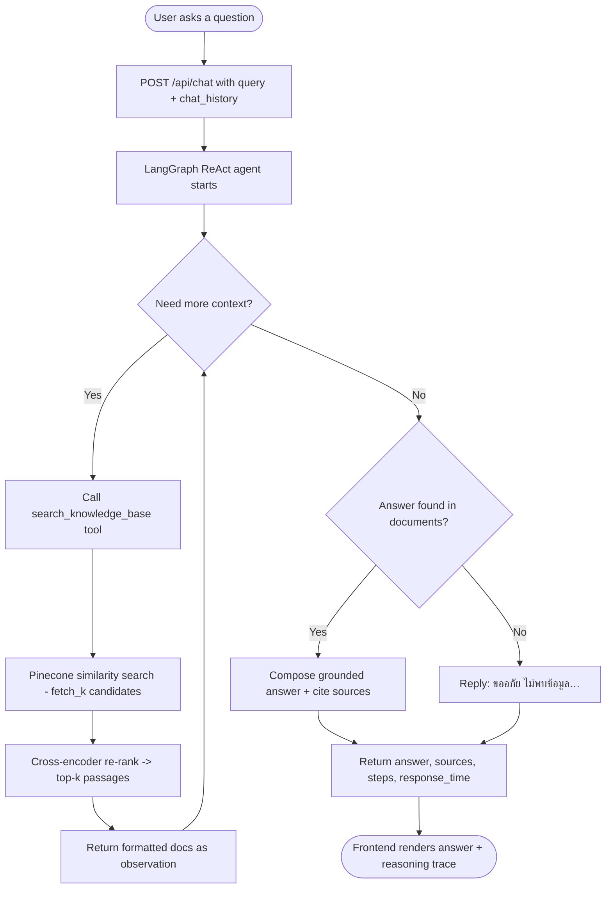
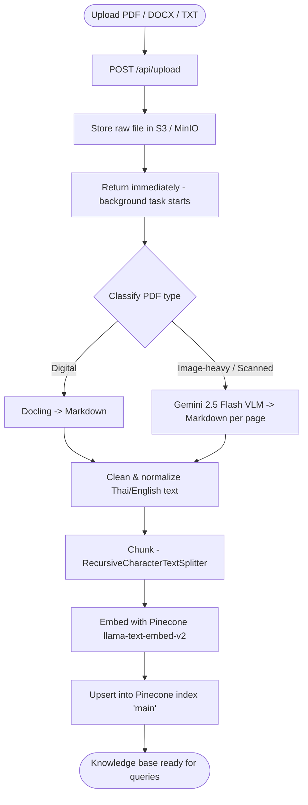

<p align="center">
  
  
  
  
  
  
  
  
  
</p>

# Agentic RAG Chatbot

A document-grounded question-answering assistant for the **Chiang Mai University Registrar** handbook (Thai-language). A user asks a question; a **LangGraph ReAct agent** decides when to search the knowledge base, retrieves passages from **Pinecone**, re-ranks them with a cross-encoder, and answers strictly from what it found — never from the model's own prior knowledge. Documents are ingested through a VLM-assisted pipeline that turns scanned and digital PDFs into clean Markdown before chunking and indexing.

Built on a **FastAPI** backend (LangGraph + LangChain) with a **React 19 / Vite** front end, **Pinecone** for vector retrieval, **MinIO/S3** for raw document storage, and a **DeepSeek** chat model for agentic reasoning.

---

## System Highlights

- **Agentic, Not Single-Shot**: A LangGraph `create_react_agent` drives the answer. The model chooses when to call `search_knowledge_base`, can issue multiple refined queries, and only stops once it has enough grounded context — rather than retrieving once and hoping.
- **Grounded by Construction**: A strict Thai system prompt forbids fabricated answers and fabricated sources. If the documents don't contain the answer, the agent replies "ขออภัย ไม่พบข้อมูล…" instead of guessing, and every cited source name comes from real retrieval output.
- **Two-Stage Retrieval**: Pinecone hosted embeddings (`llama-text-embed-v2`) fetch a broad candidate set, then a `BAAI/bge-reranker-v2-m3` cross-encoder re-scores for precision before the top passages reach the agent.
- **VLM-Assisted Ingestion**: PDFs are classified as digital, image-heavy, or scanned. Digital documents go through Docling; complex or scanned pages are converted page-by-page to Markdown by the **Gemini 2.5 Flash** vision model, preserving tables, formulas, and layout.
- **Thai-Aware Text Pipeline**: Extracted text is normalized for mixed Thai/English — broken-vowel repair, script-boundary spacing, and `pythainlp` normalization — before chunking, so retrieval quality holds up on real handbook content.
- **Async Background Ingestion**: Uploads return immediately; parsing, chunking, and indexing run in a FastAPI background task while raw files land in S3/MinIO. Models are lazy-loaded on first request to keep startup cheap.

---

## Query & Answer Flow



---

## Ingestion Pipeline



---

## Tech Stack & Directory Structure

### Application Stack

- **Backend Framework**: FastAPI (async route handlers, background tasks, lifespan startup)
- **Agent Orchestration**: LangGraph (`create_react_agent`) + LangChain Core
- **Language Model**: DeepSeek (`deepseek-chat`) via an OpenAI-compatible client
- **Frontend**: React 19, Vite, TypeScript, Tailwind CSS v4
- **Logging**: `structlog` for structured logs

### Retrieval & Services

- **Vector Database**: Pinecone (index `main`) with hosted `llama-text-embed-v2` embeddings
- **Re-ranking**: `sentence-transformers` CrossEncoder (`BAAI/bge-reranker-v2-m3`)
- **Document Parsing**: Docling + PyMuPDF for digital PDFs; Gemini 2.5 Flash VLM for scanned / image-heavy pages
- **Object Storage**: MinIO / S3 (`documents` bucket) for raw uploads, via `boto3`
- **Text Normalization**: `pythainlp` for Thai-aware cleanup
- **Infra**: Docker Compose (backend, frontend/Nginx, Postgres, MinIO)

### Directory Map

```text
backend/                       # FastAPI service
├── main.py                    # App entry point, CORS, router, lifespan
├── config.yaml                # Ingestion / embedding / vector-db settings
├── app/
│   ├── api/router.py          # /api/chat, /api/upload, /api/clear, /api/health
│   ├── core/
│   │   ├── config.py          # YAML config loader
│   │   ├── dependencies.py    # Lazy-loaded vector store, embeddings, reranker
│   │   └── logger.py          # structlog setup
│   ├── models/schemas.py      # Pydantic request models
│   ├── rag/
│   │   ├── generator.py       # RAGAgent — LangGraph ReAct agent + retries
│   │   ├── retriever.py       # PineconeRetriever + cross-encoder re-ranking
│   │   └── prompts.py         # Thai system prompt (strict grounding rules)
│   ├── tools/search.py        # search_knowledge_base agent tool
│   ├── services/
│   │   ├── chat_service.py    # Chat business logic + response serialization
│   │   ├── ingestion_service.py # Clean, chunk, embed, index documents
│   │   ├── pdf_processor.py   # PDF classification + Docling/Gemini parsing
│   │   └── s3_service.py      # MinIO/S3 upload helpers
│   └── storage/vector_store.py # Pinecone load / save / clear
└── tests/                     # Pytest unit tests
frontend/                      # React 19 + Vite + Tailwind v4 SPA
evaluation/                    # RAG / retrieval / latency benchmarks + datasets
notebook/                      # Exploration notebooks (agentic_rag, pdf_conversion)
docker-compose.yml             # Backend, frontend, Postgres, MinIO orchestration
```

---

## Setup & Installation

### Prerequisites

- **Python**: 3.10 or higher
- **Node.js**: v20 or higher
- **Docker** (optional, for the one-command stack)
- **API keys**: Pinecone, DeepSeek, and Google Gemini

### 1. Clone & Install

```bash
git clone <repository-url>
cd agentic-rag-chatbot
```

### 2. Environment Variables

Create `backend/.env`:

```env
DEEPSEEK_API_KEY=your_deepseek_key
PINECONE_API_KEY=your_pinecone_key
GOOGLE_API_KEY=your_gemini_key

# Optional — LangSmith tracing
LANGCHAIN_API_KEY=your_langsmith_key
LANGCHAIN_PROJECT=agentic-rag
```

> [!IMPORTANT]
> Keep every key in `backend/.env` server-side — none of these are exposed to the browser. The frontend talks only to the FastAPI backend. When running via Docker Compose, S3/MinIO and Postgres credentials are injected by the compose file.

### 3. Backend Setup

```bash
cd backend
python -m venv venv
source venv/bin/activate
pip install -r requirements.txt
uvicorn main:app --reload --host 0.0.0.0 --port 8000
```

### 4. Frontend Setup

```bash
cd frontend
npm install
npm run dev
```

---

## Running the App

### Local Development

| Surface          | URL                            | Notes                                       |
| ---------------- | ------------------------------ | ------------------------------------------- |
| Frontend (SPA)   | `http://localhost:5173`        | Chat UI + document upload                   |
| Backend API      | `http://localhost:8000`        | FastAPI service                             |
| MinIO Console    | `http://localhost:9001`        | Object storage UI (Docker only)             |

### Docker (Full Stack)

Brings up the backend, the Nginx-served frontend, Postgres, and MinIO (with the `documents` bucket auto-created):

```bash
docker-compose up --build -d
```

### Lint & Test

```bash
# Backend
cd backend && pytest

# Frontend
cd frontend && npm run test
```

---

## API Reference

| Method | Endpoint        | Description                                                        |
| ------ | --------------- | ----------------------------------------------------------------- |
| `POST` | `/api/chat`     | Run the agentic RAG pipeline; returns answer, sources, and steps. |
| `POST` | `/api/upload`   | Upload PDF / DOCX / TXT; ingestion runs in the background.         |
| `POST` | `/api/clear`    | Clear the Pinecone knowledge base.                                |
| `GET`  | `/api/health`   | Report model and knowledge-base readiness.                        |

---

## Coding Guidelines & Rules

1. **Keep the agent grounded**: Answers must come only from `search_knowledge_base` output. Never relax the strict no-fabrication rules in `app/rag/prompts.py`, including the zero-fake-source guarantee.
2. **Retrieve, then re-rank**: Preserve the two-stage flow — broad Pinecone fetch followed by cross-encoder re-ranking in `PineconeRetriever`. Don't return raw similarity results to the agent.
3. **Validate at the boundary**: Define request shapes as Pydantic models in `app/models/schemas.py` and parse inputs before use.
4. **Keep secrets server-side**: All keys live in `backend/.env` and are read in backend modules only. The frontend never touches provider credentials.
5. **Ingest asynchronously**: Uploads must return immediately and process via FastAPI background tasks; keep heavy parsing off the request path.
6. **Mind Thai text**: Run extracted content through the normalization pipeline (broken-vowel repair, script-boundary spacing, `pythainlp`) before chunking — retrieval quality depends on it.
